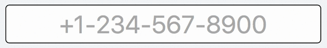

# MaskerJS

[](https://github.com/Mike96Angelo/Masker/releases)
[](https://www.npmjs.com/package/maskerjs)
[](https://npm-stat.com/charts.html?package=maskerjs&from=2017-01-28)
[](https://npm-stat.com/charts.html?package=maskerjs&from=2017-01-28)

A simple JavaScript library for masking HTML input fields.

### Install:
```
$ npm install --save maskerjs
```
# What MaskerJS Looks Like



* [Docs](docs/maskerjs.md)
* [JSFiddle](https://jsfiddle.net/fypyk2jp/14/)

### app.html:

```html
<input id="tel" type="tel" placeholder="+1-234-567-8900">
```

### app.js:

```JavaScript
var Masker = require('maskerjs');

var telMask = new Masker(
    [
        '___-____',            // local
        '(___) ___-____',      // area
        '+_-___-___-____',     // international
    ],
    /^[0-9]$/ // allowed chars
);

var telInput = document.getElementById('tel');

telMask.mask(telInput);
// telMask.unmask(telInput);

var val = telMask.unmaskVal(telInput.value);

```

## Use MaskerJS with jQuery

```JavaScript
var Masker = require('maskerjs');

// added the plugin to jQuery
Masker.jQueryPlugin(jQuery);

var telMask = new Masker(
    [
        '___-____',            // local
        '(___) ___-____',      // area
        '+_-___-___-____',     // international
    ],
    /^[0-9]$/ // allowed chars
);

// pass in a Masker object
jQuery('input[type="tel"]').mask(telMask);

// pass in the constructor arguments
jQuery('input[type="tel"]').mask(
    [
        '___-____',            // local
        '(___) ___-____',      // area
        '+_-___-___-____',     // international
    ],
    /^[0-9]$/ // allowed chars
);

// remove the masker
jQuery('input[type="tel"]').unmask();

// get the element.value masked with the passed in masker
jQuery('input[type="tel"]').maskVal(masker);
jQuery('input[type="tel"]').maskVal(patterns, filter);

// get the element.value unmasked
jQuery('input[type="tel"]').unmaskVal();
```
